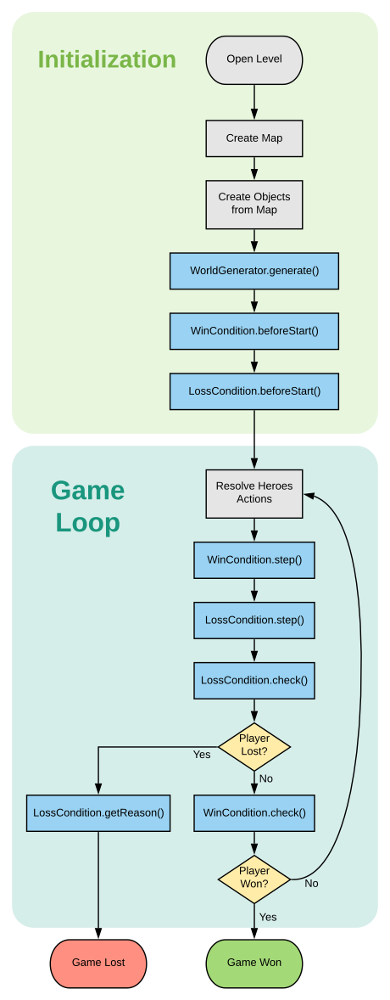

# Level object

The Level object holds all the information of a Selfless Heroes level. It is
defined in a javascript module file named `level.js` and should be the main
export of this module.

`level.js`:

```javascript
module.exports = levelObject
```

## Properties

-   `mapConfig` [MAP_CONFIG] it must always have value `MAP_CONFIG`. The
    `shutils pack-level` command requires this specific keyword in order to know
    where to insert the map into the level object. **required**

    `level.js`:

    ```javascript
    module.exports = {
    	mapConfig: MAP_CONFIG,
    	// ...
    }
    ```

-   `messages` \[[LocalizedMessages](LocalizedMessages.md)] contains localized
    texts to be displayed by the game. See
    [LocalizedMessages documentation](LocalizedMessages.md) for more details.
    Must contain at least a `name`, an `objective` and one message for each
    [CustomLossCondition](Ruleset.md#customlosscondition). **required**

-   `maxStep` [integer] maximum number of step to solve the level. If the
    solution of the player takes more steps than this value, the game will stop
    and show the message "Your program takes too much time". Maximum
    value: 20000. It is advised to set `maxStep` to approximately
    `4 * speedTarget`. **required**

-   `speedTarget` [integer] number of step of the speed secondary objective.
    Must be lower or equal to `maxStep`. **required**

-   `lengthTarget` [integer] number of lines of the code length secondary
    objective. **required**

-   `worldGenerator` \[[WorldGenerator](WorldGenerator.md)] a
    [WorldGenerator](WorldGenerator.md) object which creates objects in the
    level during initialization. See
    [WorldGenerator documentation](WorldGenerator.md) for more details.

-   `compilerConfig` \[[CompilerConfig](CompilerConfig.md)] a
    [CompilerConfig](CompilerConfig.md) object which defines the instructions
    available in the level. See
    [CompilerConfig documentation](CompilerConfig.md) for more details.
    **required**

-   `ruleset` \[[Ruleset](Ruleset.md)] a [Ruleset](Ruleset.md) object which
    defines the rules of the level: win condition and loss conditions. See
    [Ruleset documentation](Ruleset.md) for more details. **required**

-   `deterministic` [boolean] a deterministic level doesn't use any randomness.
    Setting deterministic to `true` speeds up greatly the tests in the game.
    Before setting deterministic to `true`, make sure the level don't use any
    call to `WorldProxy.rng()` and don't use any egg with random value.
    **default:** `false`

-   `startingCode` [string] code with which the player will start the level
    with. It's useful when you want to propose a starting point for the player
    to build his solution upon. **default:** `""`

-   `startingEditorType` [string] type of editor to use when opening the level.
    Possible values: `"graph"` \| `"code"`. **default:** `"graph"`

## Life cycle


