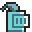
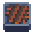
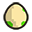
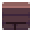
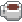
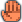
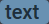
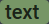
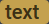
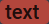

# LocalizedMessages

LocalizedMessages contains localized messages to be displayed in a level.

## Example

```javascript
{
  "en": {
    "name": "Picking",
    "objective": "Put one %%icon icon-egg$%% egg which is less than 4\ninto each %%icon icon-cauldron$%% cauldron\n\n%%icon mdi mdi-information-outline$%% If you want to test the value of an %%icon icon-egg$%% egg which is on the floor, you can use a %%icon icon-direction$%% direction. Your heroes are smart enough to understand that you're talking about the %%icon icon-egg$%% egg.",
    "loss_reason_one_egg_ge_4": "You put an %%icon icon-egg$%% egg greater or equal to 4\nin a %%icon icon-cauldron$%% cauldron"
  },
  "fr": {
    "name": "Cueillette",
    "objective": "Mets un %%icon icon-egg$%% œuf inférieur à 4\ndans chaque %%icon icon-cauldron$%% chaudron\n\n%%icon mdi mdi-information-outline$%% Si tu veux tester la valeur d'un %%icon icon-egg$%% œuf qui est sur le sol, tu peux utiliser une %%icon icon-direction$%% direction. Tes héros sont assez intelligents pour comprendre que tu parles de l'%%icon icon-egg$%% œuf.",
    "loss_reason_one_egg_ge_4": "Tu as mis un %%icon icon-egg$%% œuf supérieur ou égal à 4\ndans un %%icon icon-cauldron$%% chaudron"
  }
}
```

## Supported languages

The first level of properties are language code keys. For now, Selfless Heroes
is supporting the following languages:

| Language code (ISO 639-1) | Language   | Status                       |
| ------------------------- | ---------- | ---------------------------- |
| de                        | German     | :white_check_mark: supported |
| en                        | English    | :white_check_mark: supported |
| es                        | Spanish    | :white_check_mark: supported |
| fr                        | French     | :white_check_mark: supported |
| pl                        | Polish     | :white_check_mark: supported |
| pt                        | Portuguese | :white_check_mark: supported |
| ar                        | Arabic     | :loop: work in progress      |
| eo                        | Esperanto  | :loop: work in progress      |
| it                        | Italian    | :loop: work in progress      |
| ru                        | Russian    | :loop: work in progress      |

If you would like to see your own language added to this list, contact me on
[Discord](https://discord.gg/UtKrrBM). :wink:

## Required properties

English (en) being the default language of the game, the `en` key is required.
Other languages are not. That said, it would be much appreciated to have other
languages supported too for your level. You can even provide translations in
languages that are not supported by Selfless Heroes yet, hoping that it will be
supported in the future.

Required properties of a language object:

-   `name` [string] title of the level. **required**

-   `objective` \[[SelflessHeroesString](#selflessheroesstring)] objective of
    the level. **required**

-   1 property by
    [CustomLossCondition](Ruleset.md#customlossconditiongetreasonworld-required).
    \[[SelflessHeroesString](#selflessheroesstring)] **required**

## SelflessHeroesString

`objective` and loss reason properties use SelflessHeroesString notation. It
allows the use of icons and styling in messages.

The general form is `%%style$text%%` with `style` and `text` varying according
to your needs.

### Icons

| Icon                                                      | Name           | Notation                                  |
| --------------------------------------------------------- | -------------- | ----------------------------------------- |
|  | information    | `%%icon mdi mdi-information-outline$%%`   |
|    | warning        | `%%icon mdi mdi-alert-octagon-outline$%%` |
|                        | hero           | `%%icon icon-hero$%%`                     |
|                  | bonfire        | `%%icon icon-bonfire$%%`                  |
|                | cauldron       | `%%icon icon-cauldron$%%`                 |
|                          | egg            | `%%icon icon-egg$%%`                      |
|                    | spikes         | `%%icon icon-spikes$%%`                   |
|                    | switch         | `%%icon icon-switch$%%`                   |
|            | switch-red     | `%%icon icon-switch-red$%%`               |
|                      | floor          | `%%icon icon-floor$%%`                    |
|                        | wall           | `%%icon icon-wall$%%`                     |
|                        | hole           | `%%icon icon-hole$%%`                     |
|                | infected       | `%%icon icon-infected$%%`                 |
|                          | npc            | `%%icon icon-npc$%%`                      |
|                    | myitem         | `%%icon icon-myitem$%%`                   |
|                    | number         | `%%icon icon-number$%%`                   |
|                | variable       | `%%icon icon-variable$%%`                 |
|                  | nothing        | `%%icon icon-nothing$%%`                  |
|              | direction      | `%%icon icon-direction$%%`                |
|                | everyone       | `%%icon icon-everyone$%%`                 |
|    | message-coffee | `%%icon icon-message-coffee$%%`           |
|          | message-hey    | `%%icon icon-message-hey$%%`              |
|            | message-ho     | `%%icon icon-message-ho$%%`               |
|        | message-kiss   | `%%icon icon-message-kiss$%%`             |
|          | message-lol    | `%%icon icon-message-lol$%%`              |
|            | message-ok     | `%%icon icon-message-ok$%%`               |
|        | message-stop   | `%%icon icon-message-stop$%%`             |
|        | message-wait   | `%%icon icon-message-wait$%%`             |

### Styles

| Styled text                                                                        | Name                | Notation                                 |
| ---------------------------------------------------------------------------------- | ------------------- | ---------------------------------------- |
|  | branching-statement | `%%statement branching-statement$text%%` |
|        | action-statement    | `%%statement action-statement$text%%`    |
|        | assign-statement    | `%%statement assign-statement$text%%`    |
|        | speach-statement    | `%%statement speach-statement$text%%`    |
|                  | level-title         | `%%level-title$text%%`                   |
