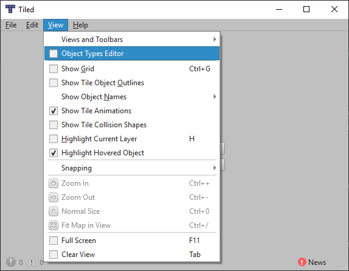
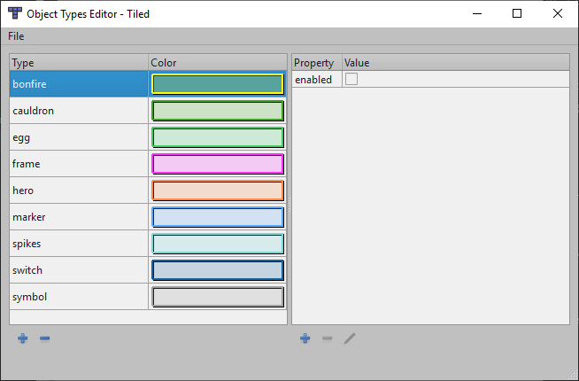

# Installation guide

In this guide we will see how to install all necessary software to create levels
for Selfless Heroes.

## Selfless Heroes

You must have a copy of the game installed on your machine. It doesn't matter
from which source you got the game from, you just have to own the full version
of the game.

:pushpin: Mac OSX users cannot create levels for the time being.

## Install Selfless Heroes utilities

Download `sh-leveleditor-{platform}.zip` corresponding to your platform from
GitHub: <https://github.com/felicien-brochu/selflessheroes/releases/latest>

This archive contains:

-   `shutils.exe`: command line tool to create levels on windows
-   `shutils`: command line tool to create levels on linux
-   `levels`: working directory for level creation
-   `doc`: documentation folder

Extract `sh-leveleditor.zip` in the directory of your choice. This folder will
be referenced as `sh-leveleditor-dir` in the rest of this guide.

## Install Tiled

Tiled is an open source level editor for 2D games. It is the main piece of
software used to create Selfless Heroes levels.

Download and install the latest release of Tiled map editor from GitHub:
<https://github.com/bjorn/tiled/releases/latest>

Tiled is an awesome free and open source project with a great community. Check
it out on <https://www.mapeditor.org> :wink:

### Import Selfless Heroes object types in Tiled

Open Tiled and click on `View` > `Object Types Editor`.

In the newly open window, click on `File` > `Import Object Types...` and select
`sh-leveleditor-dir/levels/objecttypes.xml`.
You should get the following window:

You have now all the necessary software installed in order to create levels for
Selfless Heroes! :grin:

Let's make our first level, shall we?

Next: [:arrow_forward: Tutorial 1: create our first level](tutorial1.md)
