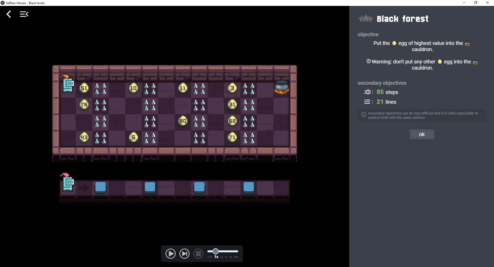

# Tutorial 2 - Part 1: Setting up the project

In this tutorial, we will create a level using most of the capabilities of the
game and then we will publish it on Selfless Heroes API for review.

Here is the level we will create:

## Requirements

To follow this tutorial, you must have all necessary software installed as
described in the [installation guide](installation.md) and you must have
followed the [first tutorial](tutorial1.md).

## Setting up the project

Copy the folder `sh-leveleditor-dir/levels/tutorial2_start` to
`sh-leveleditor-dir/levels/black_forest`.

Unlike in the first tutorial, `level.js` and `metadata.json` are pretty much
empty. We will mainly focus on the creation of these files in this tutorial.

Next: [:arrow_forward: Part 2: Create the map](tutorial2_2.md)
