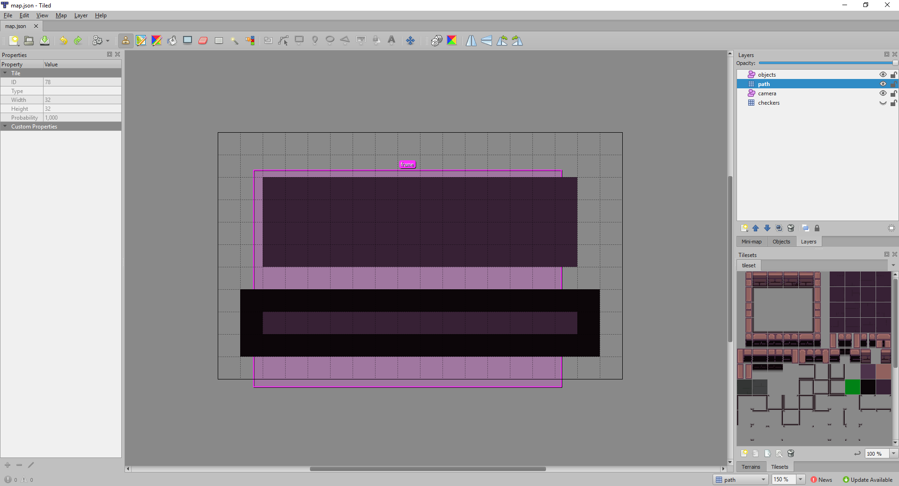
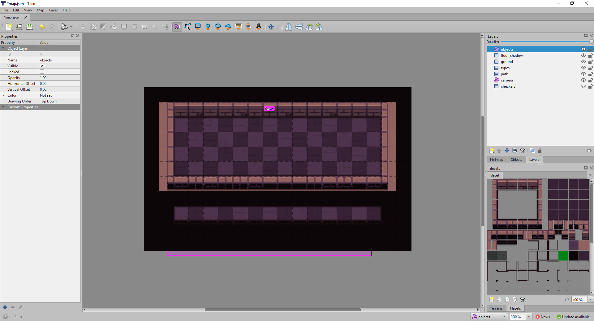
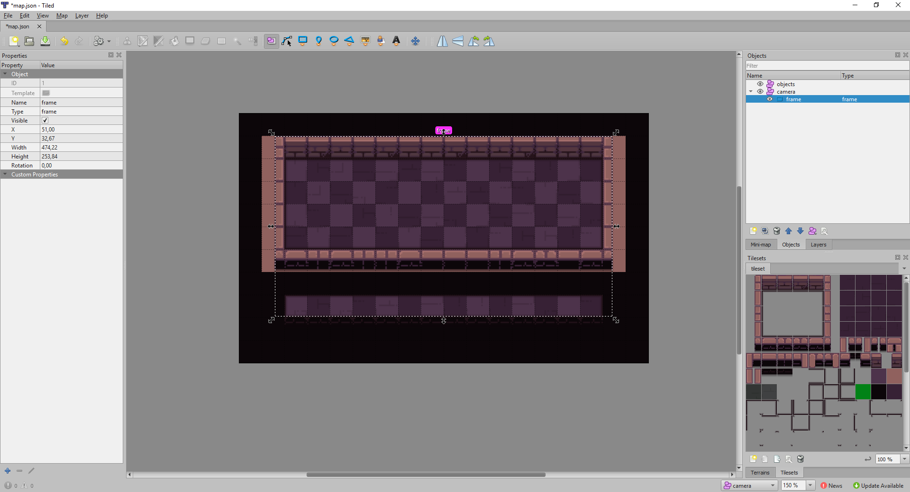
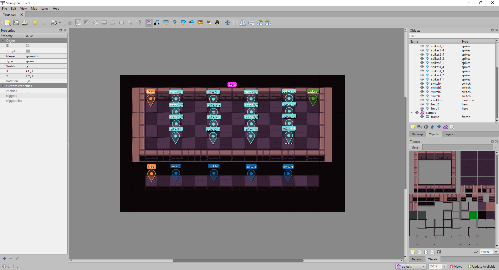
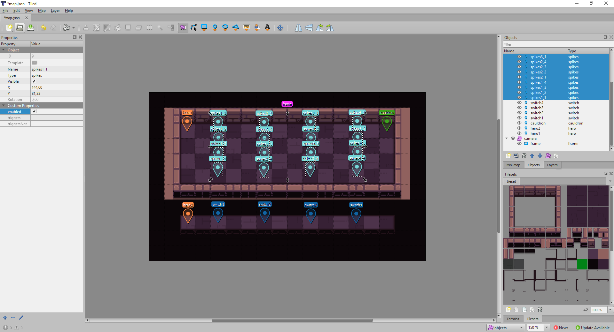
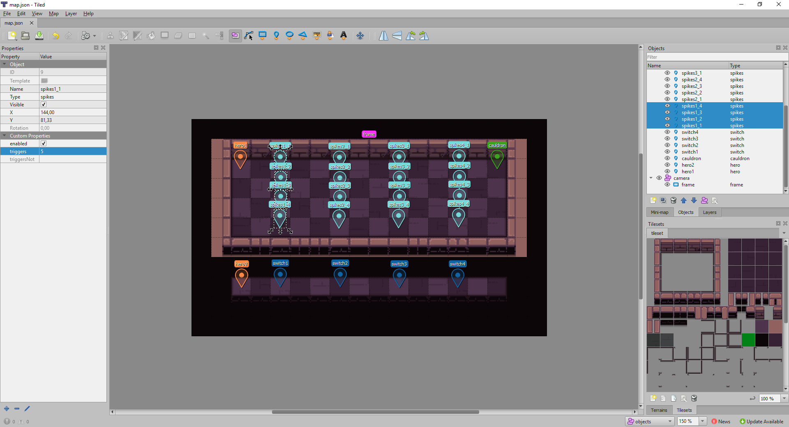

# Tutorial 2 - Part 2: Create the map

Open `sh-leveleditor-dir/levels/black_forest/map.json` with Tiled.

Resize the map to these dimensions: width: 18 tiles; height: 11 tiles.

Draw the floor and holes on the `path` layer as in the screenshot bellow.



Use the automapping by pressing <kbd>Ctrl</kbd>+<kbd>M</kbd>.

Move `objects` layer all the way to the top in the `Layers` panel to better see
the objects we will create.



Resize the `frame` of the `camera` to match the edges of the map.



## Populate the map with objects in Tiled

Create 2 heroes, 1 cauldron, 4 switches and 16 spikes in `objects` layer.



## Configure the world objects

We want the spikes to be up at the start of the level: select all spikes and
check the `enabled` custom property in the left panel.



When the bottom hero walks on a switch, we want the spikes on the same column to
be disabled. To do so we will have to use the
[spikes triggering system](ObjectConfig.md#spikesconfig).

Select the left most switch and note its `ID` property (you can read it in the
	first line of the left panel). Then select all spikes that are on the same
	column and write this `ID` in the `triggers` property.



Repeat this process for the 3 other columns of spikes.

Now the spikes will be triggered by the switches. :wink:

### Test the spikes

Package the level:

```shell
shutils pack-level levels/black_forest --watch
```

Open the level in the game:

```shell
selflessheroes --dev levels/black_forest/level.shlv
```

Let's test that the spikes are indeed triggered by the switches with a simple
code:

    a:
    step(e)
    jump a


The heroes should step all the way to the right without dying in the spikes.

Next: [:arrow_forward: Part 3: Create objects programmatically](tutorial2_3.md)
