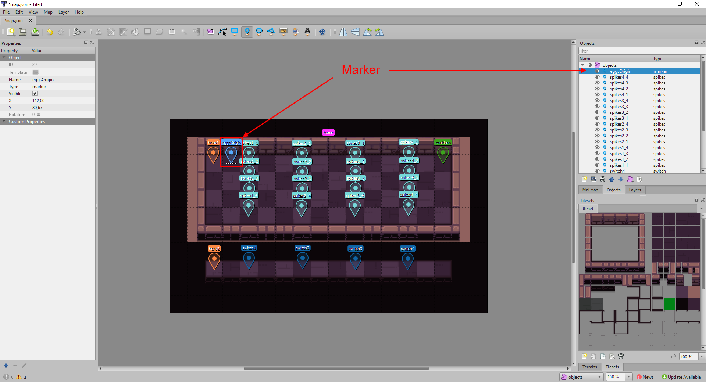
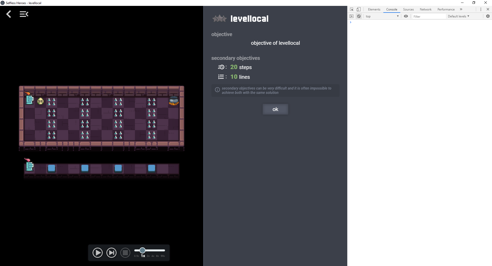
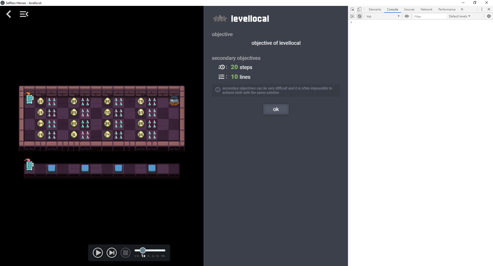
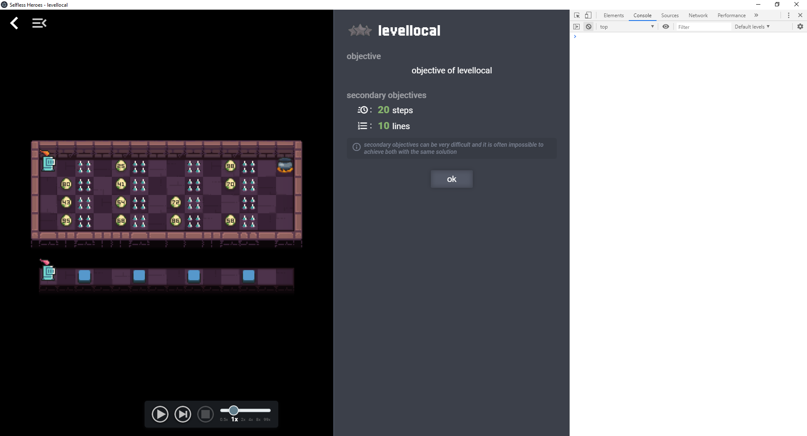
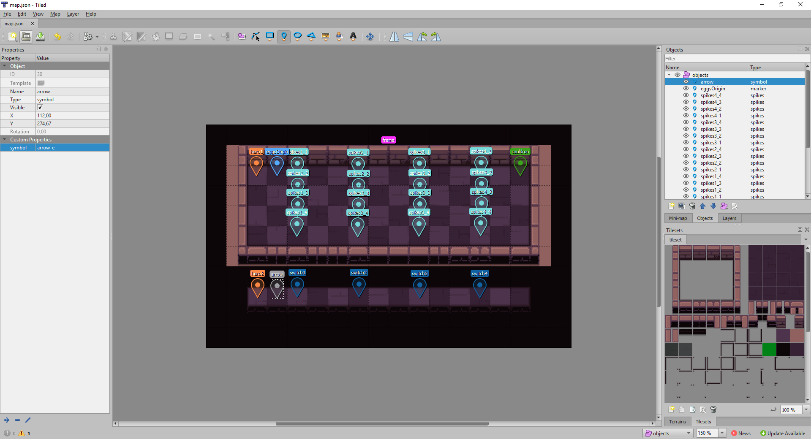

# Tutorial 2 - Part 3: Create objects programmatically

We will create the eggs programmatically by editing `level.js`.

In order to create world objects during the initialization of the level, we will
add a [`WorldGenerator`](WorldGenerator.md) to `level.js`.

But first, let's add a [marker](ObjectConfig.md#markerconfig) object to the map
in Tiled. A [marker](ObjectConfig.md#markerconfig) is an invisible object. It
does not interact with any other object in the game. It's used as a reference
point to build other objects programmatically.



Open `level.js` in a text editor and write this:

```javascript
module.exports = {
  mapConfig: MAP_CONFIG,

  worldGenerator: {
    generate(world) {
      // Find the marker created in Tiled. We know its ID is 29 from Tiled.
      let marker = world.findObjectByID(29)

      // Create an egg at the marker coordinates.
      world.createObject("egg", {
        x: marker.x,
        y: marker.y,
        value: "rng(0,99)"
      })
    }
  }
}
```

This code creates an egg at the coordinates of the marker with a random value
from 0 to 99.

Relevant documentation to better understand this code:

-   [`Level`](Level.md)
-   [`WorldGenerator`](WorldGenerator.md)
-   [`WorldProxy.findObjectByID()`](WorldProxy.md#findobjectbyidid)
-   [`WorldProxy.createObject()`](WorldProxy.md#createobjecttype-objectconfig)
-   [`EggConfig`](ObjectConfig.md#eggconfig)
-   [`Marker`](WorldObject.md#marker)



We want to create 4 eggs in front of each column of spikes. So change `level.js`
to this:

```javascript
module.exports = {
  mapConfig: MAP_CONFIG,

  worldGenerator: {
    generate(world) {
      // Find the marker created in Tiled. We know its ID is 29 from Tiled.
      let marker = world.findObjectByID(29)

      // Create 4 columns of eggs in front of the spikes.
      for (let i = 0; i < 4; i++) {
        for (let j = 0; j < 4; j++) {
          world.createObject("egg", {
            x: marker.x + (i * 3),
            y: marker.y + j,
            value: "rng(0,99)"
          })
        }
      }
    }
  }
}
```



## Add randomness

We want that each column of eggs have a random number of eggs in it, from 2 to 4
eggs.

```javascript
module.exports = {
  mapConfig: MAP_CONFIG,

  worldGenerator: {
    generate(world) {
      // Find the marker created in Tiled. We know its ID is 29 from Tiled.
      let marker = world.findObjectByID(29)

      // Create 4 columns of eggs in front of the spikes.
      for (let i = 0; i < 4; i++) {

        // Generate a random number between 2 and 4 using WorldProxy.rng()
        let numberOfEggs = 2 + Math.floor(world.rng() * 3)

        let availableSpots = [0, 1, 2, 3]
        for (let j = 0; j < numberOfEggs; j++) {
          // Select a random spot for the egg
          let spotIndex = Math.floor(world.rng() * availableSpots.length)
          let spot = availableSpots[spotIndex]

          // Create the egg in the chosen spot
          world.createObject("egg", {
            x: marker.x + (i * 3),
            y: marker.y + spot,
            value: "rng(0,99)"
          })

          // Remove the chosen spot from the available spots
          availableSpots.splice(spotIndex, 1)
        }
      }
    }
  }
}
```

You don't have to understand how this code works exactly. But note that instead
of using the usual `Math.random()` function to generate a random number, we use
[`world.rng()`](WorldProxy.md#rng). When you want to use randomness in a level,
you **must** use [`world.rng()`](WorldProxy.md#rng). This function is a seeded
pseudo-random number generator, meaning that it produces pseudo-random numbers
in a reproducible manner. It's very important for the game to work properly that
these random numbers are reproducible.



## Decoration

### Egg lottery animation

The value of the eggs are random, but the player doesn't know about it. Let's
add an animation to the egg value at the start of the level to let the player
know about it. We just have to set `showLottery` to `true` in the
[EggConfig](ObjectConfig#eggconfig) object.

```javascript
module.exports = {
  mapConfig: MAP_CONFIG,

  worldGenerator: {
    generate(world) {
      // Find the marker created in Tiled. We know its ID is 29 from Tiled.
      let marker = world.findObjectByID(29)

      // Create 4 columns of eggs in front of the spikes.
      for (let i = 0; i < 4; i++) {

        // Generate a random number between 2 and 4 using WorldProxy.rng()
        let numberOfEggs = 2 + Math.floor(world.rng() * 3)

        let availableSpots = [0, 1, 2, 3]
        for (let j = 0; j < numberOfEggs; j++) {
          // Select a random spot for the egg
          let spotIndex = Math.floor(world.rng() * availableSpots.length)
          let spot = availableSpots[spotIndex]

          // Create the egg in the chosen spot
          world.createObject("egg", {
            x: marker.x + (i * 3),
            y: marker.y + spot,
            value: "rng(0,99)",
            showLottery: true //< Show value animation at the start of the level
          })

          // Remove the chosen spot from the available spots
          availableSpots.splice(spotIndex, 1)
        }
      }
    }
  }
}
```

### Symbols

Let's add an arrow pointing right on the floor next to the bottom hero to
indicate that it's the way to go.

Open `map.json` with Tiled. Add an object of type `symbol` to the `objects`
layer. Set the `symbol` custom property to `arrow_e` (for arrow east).

See [SymbolConfig documentation](ObjectConfig.md#symbolconfig) for more details
on symbols.



Alright! Now we have all the objects of the level! :partying_face:

Next: [:arrow_forward: Part 4: Name and objective](tutorial2_4.md)
