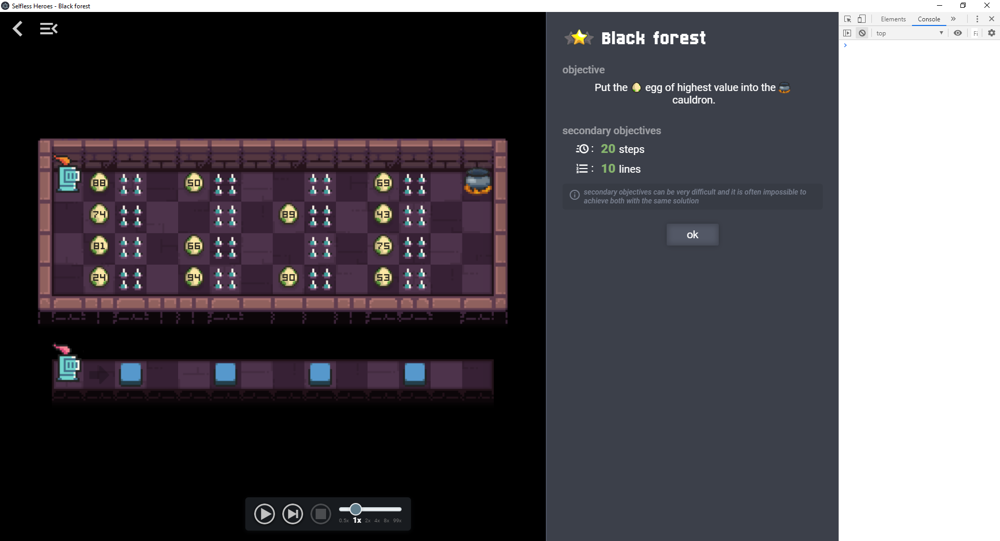

# Tutorial 2 - Part 4: Name and objective

This level is named "Black forest" and its objective is to put the egg of
highest value into the cauldron. All text displayed by the game for a level is
defined in the `messages` property of the level object.

:bulb: See [LocalizedMessages documentation](LocalizedMessages.md) for more
details on the `messages` property.

In this tutorial we define the messages for english and french languages. The
english version is required, the other languages are not. See the list of
[supported languages](LocalizedMessages.md#supported-languages).

```javascript
module.exports = {
  mapConfig: MAP_CONFIG,

  messages: {
    "en": {
      "name": "Black forest",
      "objective": "Put the %%icon icon-egg$%% egg of highest value into the %%icon icon-cauldron$%% cauldron."
    },
    "fr": {
      "name": "Forêt noire",
      "objective": "Mets l'%%icon icon-egg$%% œuf de valeur maximale dans le %%icon icon-cauldron$%% chaudron."
    }
  },

  // worldGenerator: ...
}
```



Next: [:arrow_forward: Part 5: Define the rules](tutorial2_5.md)
