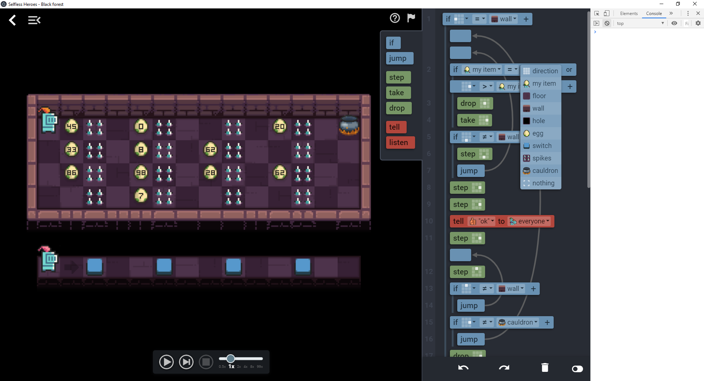

# Tutorial 2 - Part 6: Configure Selfless Heroes language capabilities

For now, the player has access to all instructions to solve the level. We will
restrict the language capabilities for the level by adding a
[CompilerConfig](CompilerConfig.md) object to the Level object.

:bulb: See [CompilerConfig documentation](CompilerConfig.md) to better
understand how to configure the language capabilities.

```javascript
module.exports = {
  // mapConfig: ...
  // messages: ...

  compilerConfig: {
    // Exclude clone and assign statements from the language
    excludePrimary: ['clone', 'assign'],
    // There is no use for variables in this level e.g. no use for value functions (set, calc, nearest)
    valueFunctions: [],
    // Available action functions
    actionFunctions: ['step', 'take', 'drop', 'tell', 'listen'],
    // expression types available for the left part of if comparisons
    leftComparisonExpressions: ['direction', 'myitem'],
    // expression types available for the right part of if comparisons
    rightComparisonExpressions: ['direction', 'myitem', 'terrain_type', 'object_type'],
    // available terrain types
    terrainTypes: ['floor', 'wall', 'hole'],
    // available object types
    objectTypes: ['egg', 'switch', 'spikes', 'cauldron', 'nothing'],
    // number of different messages available
    messages: 3
  },

  // worldGenerator: ...
  // ruleset: ...
}
```



Note that the `if` dropdown displays its items in the same order as defined in
`rightComparisonExpressions`, `terrainTypes` and `objectTypes`. We can make the
same remark about `actionFunctions` which defines in which order these
instructions are displayed in the instruction panel.

Next: [:arrow_forward: Part 7: Secondary objectives](tutorial2_7.md)
